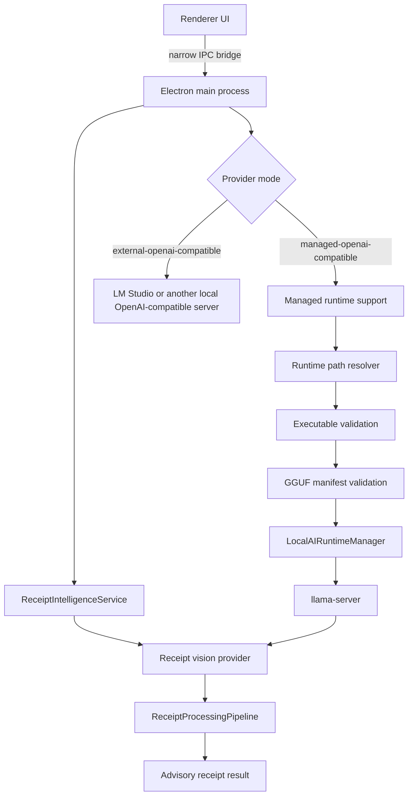

# Local AI Architecture

## Overview

The Local AI subsystem provides receipt-analysis suggestions without making Local AI authoritative over receipt saving, OCR, matching, or database records. It is owned by the Electron main process; renderer code consumes narrow status and review-result boundaries only.

Two OpenAI-compatible provider modes are supported:

- **External OpenAI-compatible**: connects to an already-running server such as LM Studio.
- **Managed runtime**: validates a local GGUF vision model and a `llama-server` executable, then lets the main-process runtime manager launch the server when managed mode is requested.

Both modes ultimately use `OpenAICompatibleReceiptVisionProvider`, so receipt prompting and post-generation processing stay consistent.



## Managed Runtime Flow

The future-facing managed flow is intentionally guarded before a process can start:

```text
Configuration
        |
        v
Runtime Path Resolver
        |
        v
Executable Validation
        |
        v
Model Registry (discovery and explicit selection support)
        |
        v
Manifest Validation
        |
        v
Runtime Manager
        |
        v
Health Check
        |
        v
OpenAI-Compatible Provider
        |
        v
Receipt Intelligence
```

Today, managed startup still uses `LOCAL_AI_MODEL_DIR` and `GGUFVisionModelManifest` directly. `GGUFVisionModelRegistry` is deliberately additive: it discovers and describes candidates for a later explicit selection phase, but does not change startup selection or routing.

If a managed prerequisite fails, the result is unavailable diagnostics rather than a failure of OCR or the normal receipt workflow. External mode does not start, stop, or validate LM Studio's executable.

## Module Responsibilities

All files below live under `local-ai/`.

| Module | Responsibility | Inputs and outputs | Intentionally does not do |
| --- | --- | --- | --- |
| `config.js` | Defines Local AI defaults and resolves the configured general model directory. | Settings in; normalized settings and model-root path out. | Launch runtimes, inspect GGUF manifests, or persist settings. |
| `VisionRuntime.js` | Defines the abstract runtime contract used by vision runtimes. | Runtime implementation in; contract validation out. | Load a backend, own sessions, or infer receipts. |
| `OnnxVisionRuntime.js` | Owns the SmolVLM ONNX session lifecycle and its staged local inference pipeline. | Model/session/image/token inputs in; raw features, generated token IDs, or generated text out. | Act as the managed `llama-server` runtime or alter receipt persistence. |
| `ModelManager.js` | Provides the older general local model-directory metadata and installation inspection layer. | Model root or ID in; metadata and directory status out. | Validate GGUF vision compatibility, launch models, or select managed runtime models. |
| `modelTypes.js` | Documents general model metadata typedefs. | Type documentation only. | Perform runtime or filesystem work. |
| `ReceiptExtractionPrompt.js` | Owns the conservative shared receipt-extraction prompt. | No runtime input; exports prompt text. | Send requests, repair JSON, or choose models. |
| `ReceiptVisionProvider.js` | Runs the legacy SmolVLM provider path and forwards its generated text to receipt processing. | Image/receipt request in; processed advisory result out. | Run in the renderer, write records, or select managed GGUF models. |
| `OpenAICompatibleReceiptVisionProvider.js` | Calls an OpenAI-compatible local chat endpoint with an image and shared prompt, then runs receipt processing. | Image buffer and generation settings in; `{ text, receipt, pipeline, metadata }` out. | Start a server, manage executable paths, or mutate application data. |
| `ReceiptProcessingPipeline.js` | Runs extraction, repair, validation, and mapping in fixed order. | Provider analysis text in; complete processing diagnostics and mapped receipt out. | Perform inference, retry generation, or make persistence decisions. |
| `ReceiptJsonExtractor.js` | Locates generated JSON text and extraction diagnostics. | Generated text in; extracted JSON candidate out. | Infer receipt data or call a provider. |
| `ReceiptJsonRepair.js` | Applies limited structural JSON repair. | Extraction result in; repaired text and repair diagnostics out. | Validate receipt schema or invent receipt values. |
| `ReceiptJsonValidator.js` | Parses repaired JSON and validates receipt shape/types. | Repair result in; parsed receipt and validation diagnostics out. | Repair text, map app fields, or call inference. |
| `ReceiptObjectMapper.js` | Maps valid snake_case receipt JSON to the application-facing advisory receipt shape. | Validation result in; mapped receipt or null out. | Accept invalid data, save records, or apply UI fields. |
| `ReceiptEvaluationHarness.js` | Supplies development-only observational evaluation of provider output. | Existing analysis in; JSON/schema observations out. | Invoke inference, repair output, or change workflows. |
| `LocalAIRuntimePaths.js` | Resolves the `llama-server` executable path from environment, packaged resources, or development layout. | Environment/process/app path context in; resolved path metadata out. | Check that a binary is usable, launch it, or modify paths. |
| `LocalAIRuntimeValidation.js` | Checks that a resolved executable exists, is a regular file, and is executable on POSIX. | Executable path in; structured validation result out. | Run the executable, chmod it, or repair installation problems. |
| `GGUFVisionModelManifest.js` | Source of truth for a GGUF vision model directory and manifest validity. | Model directory in; supported/unsupported inspection with paths/errors out. | Discover arbitrary roots, select among models, or launch a runtime. |
| `GGUFVisionModelRegistry.js` | Read-only discovery and registration of configured GGUF model roots. | Caller-supplied roots in; valid models, invalid candidates, warnings, and selection diagnostics out. | Call `app.getPath`, alter selection/configuration, or launch a model. |
| `LocalAIRuntimeManager.js` | Owns managed `llama-server` child-process lifecycle, free-port choice, health checks, logs, and shutdown. | Concrete executable/model options in; runtime status and endpoint URLs out. | Validate manifests, discover models, route providers, or control UI. |
| `ManagedOpenAICompatibleSupport.js` | Coordinates managed-mode configuration, executable validation, manifest inspection, runtime readiness, and provider options. | Environment and injected manager/inspectors in; fail-open managed availability/provider options out. | Implement receipt prompting, change external mode, or persist configuration. |

## Provider Architecture

The renderer never imports an inference runtime, tokenizer, ONNX backend, `llama-server` manager, or receipt provider. It uses the preload bridge to request status or a review through the main process.

```text
External mode
  Renderer -> main process -> OpenAICompatibleReceiptVisionProvider -> LM Studio

Managed mode
  Renderer -> main process -> ManagedOpenAICompatibleSupport
           -> LocalAIRuntimeManager -> llama-server
           -> OpenAICompatibleReceiptVisionProvider -> managed localhost endpoint
```

`ReceiptIntelligenceService` remains the advisory service boundary. Providers return advisory text, processed receipt data, pipeline diagnostics, and generation metadata; they do not silently apply form changes or save database records.

## Configuration

Managed runtime configuration is currently environment-driven. None of these variables add a settings UI or persist configuration in this phase.

| Variable | Purpose | Current consumer |
| --- | --- | --- |
| `LOCAL_AI_PROVIDER_MODE` | Selects `external-openai-compatible` by default or `managed-openai-compatible`. | `ManagedOpenAICompatibleSupport` and main-process provider setup. |
| `LOCAL_AI_LLAMA_SERVER_PATH` | Explicit executable override; takes precedence over packaged/development path resolution. | `LocalAIRuntimePaths`. |
| `LOCAL_AI_MODEL_DIR` | Directories for the currently configured managed GGUF model. | `ManagedOpenAICompatibleSupport` and `GGUFVisionModelManifest`. |
| `LOCAL_AI_CTX_SIZE` | Optional managed `llama-server` context-size override. | `ManagedOpenAICompatibleSupport`, then `LocalAIRuntimeManager`. |
| `LOCAL_AI_GPU_LAYERS` | Optional managed GPU-layer count. | `ManagedOpenAICompatibleSupport`, then `LocalAIRuntimeManager`. |
| `LOCAL_AI_STARTUP_TIMEOUT_MS` | Optional timeout while the managed server becomes healthy. | `ManagedOpenAICompatibleSupport`, then `LocalAIRuntimeManager`. |

`config.js` separately defines Local AI application defaults, including the external OpenAI-compatible endpoint, default completion budget, and legacy/general model-directory settings.

## Diagnostics and Failure Modes

The Local AI diagnostics panel renders the existing main-process status payload. It is read-only; it does not alter runtime state.

Useful diagnostics include provider mode, availability, managed runtime status, endpoint, model identity, health, executable validation details, manifest errors, registry warnings, and recent runtime logs.

| Scenario | Expected result |
| --- | --- |
| LM Studio is not running in external mode | OpenAI-compatible health check reports unavailable; deterministic receipt processing continues. |
| `LOCAL_AI_MODEL_DIR` is absent in managed mode | Managed mode is unavailable with a configuration reason; no process starts. |
| Resolved executable is missing, a directory, or lacks POSIX execute permission | Executable validation reports unavailable; no runtime-manager start/restart is attempted. |
| Manifest is malformed or GGUF/mmproj is missing | Manifest inspection fails with errors; no runtime starts. |
| Registry encounters one invalid candidate | Candidate appears in `invalidCandidates`; valid siblings continue to be discovered. |
| Duplicate registered model IDs | Discovery warns and explicit selection returns ambiguity instead of choosing arbitrarily. |
| `llama-server` fails to start or become healthy | Runtime manager records error/log status; Local AI remains fail-open. |

## Where Future Changes Belong

| Change | Add it here | Do not put it here |
| --- | --- | --- |
| New GGUF manifest rule | `GGUFVisionModelManifest.js` | Registry or runtime manager. |
| New model-root source/discovery policy | Main-process caller plus `GGUFVisionModelRegistry.js` | Manifest validator. |
| Explicit selected-model routing | A future managed-mode selection layer built on registry selection output. | Renderer, provider prompt, or runtime manager. |
| Runtime argument or lifecycle behavior | `LocalAIRuntimeManager.js` and managed support wiring. | Receipt processing pipeline. |
| Executable location/package layout | `LocalAIRuntimePaths.js` and packaging configuration. | Providers or renderer. |
| Receipt prompt changes | `ReceiptExtractionPrompt.js`. | Runtime manager or manifest validator. |
| JSON extraction/repair/schema behavior | The relevant `ReceiptJson*` module or mapper. | Provider routing. |
| UI display/status changes | Renderer display helpers and IPC payload consumers. | Runtime lifecycle code. |

## Roadmap

Completed:

- OpenAI-compatible receipt provider with external LM Studio support.
- Managed `llama-server` lifecycle manager and health checks.
- Runtime path resolver and packaging resource layout contract.
- Executable validation before managed startup.
- GGUF vision manifest validation.
- Read-only GGUF model registry and ambiguity-safe selection helper.
- Read-only Local AI diagnostics panel.

Upcoming:

- Explicit managed model selection wired to the registry.
- First-run model import and registration workflow.
- Platform-specific bundled `llama-server` binaries.
- Standalone installer validation and distribution work.
- Runtime controls such as restart/stop and model-management settings.

## Design Principles

- Renderer code never owns inference.
- `LocalAIRuntimeManager` owns managed process lifecycle.
- `GGUFVisionModelManifest` is the source of truth for individual model validity.
- `GGUFVisionModelRegistry` discovers models but never launches, configures, or selects one implicitly.
- Executable and model validation happen before managed runtime startup.
- Managed Local AI fails open; OCR and the existing receipt workflow remain usable when AI is unavailable.
- External LM Studio support remains available alongside managed mode.
- Each module should have one clear responsibility and avoid duplicating another module's validation or lifecycle work.
